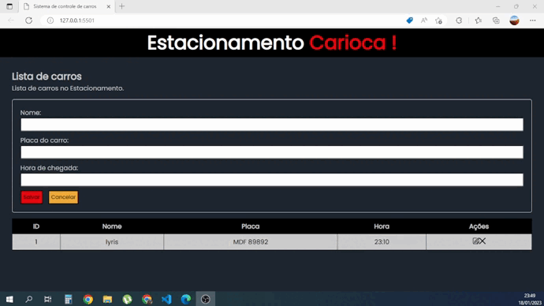

<h1>
        
</h1>

## 👩🏽‍💻 Sobre o Projeto Estacionamento Carioca

Mas um projeto pronto e foi um verdadeiro desafio, pude usar todo meu conhecimento de Javascript Puro Orientado a Objetos para desenvolver uma interface de  controle de carros do estacionamento carioca.

- Adicionar e Manipular Objetos no Array
- Listar Dados do Array
- Remover Elementos e Objetos do Array
- Editar Itens do Array e Exibir no HTML com Json

## 👩🏽‍💻 Tecnologia Utilizada

O projeto foi desenvolvido com as seguintes tecnologias

- HTML

- CSS

- Javascript

## 👩🏽‍💻 Acesse o projeto

 <h3>
        <a href="https://lyrisnunes.github.io/controle-de-estacionamento/"> - Veja o projeto clique aqui </a>
</h3>